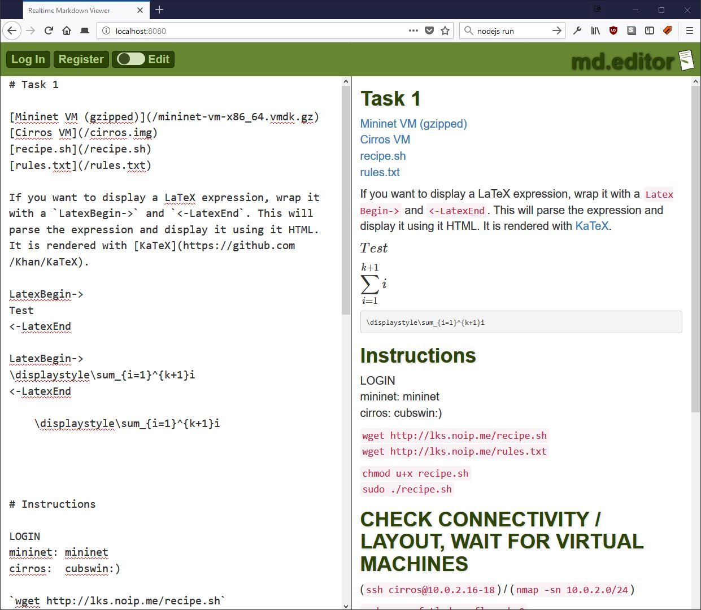

MD.Editor
=========

Another single page application, this time a Markdown editor. On one side, it displays the raw text,
on the other side, it displays the beatuified Markdown version. The content itself are references to an old cloud infrastructure exercise, don't bother with them.

It uses Javascript on the server (node.js) and on the client side with Libraries like Showdown for text-to-markdown and HTML output. The output is then styled according to the style.css.

